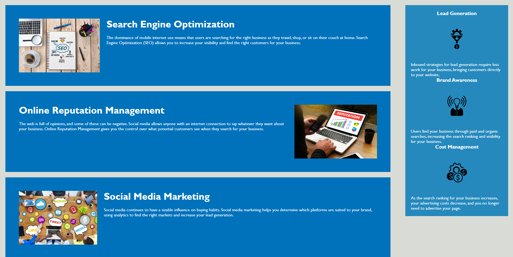

# README

## Description

Starter code provided, needed to have semantic elements add into HTML and needed comments added to both HTML and css for better understanding. 
- div elements changed to semantic elements i.e. div changed into form, table, article, nav, details and so forth
- Comments added throughout HTML within <!--these brackets--> so as to not break the code
- Comments added throughout CSS within /* These brackets */ so as to not break the code

## Installation

- No downloads necessary, follow link to open webpage and interact with live page [https://lesliefg.github.io/module-one/]
- Or follow this link to repo to view code and comments [https://github.com/lesliefg/module-one]

## Usage

Live webpage link provided [https://lesliefg.github.io/module-one/]
Github repo link [https://github.com/lesliefg/module-one]

- HTML and CSS code is updated to provide semantic elements in code for easier and quicker navigation and understanding. 
- Comments also left throughout HTML and CSS to help other contributors to better understand sections of the code and what each section does.

* Example Screenshot of HTML comments 
* Example Screenshot of CSS comments 
* Example Screenshots of deployed webpage are at the bottom of the README

## Credits

Starter code provided by Xander Rapstine Github profile [https://github.com/Xandromus]

## License

Please refer to the LICENSE in the repo.

## Features
- Semantic elements in HTML code for easier reading
- HTML comments in <!--These brackets--> for better unstanding of each section 
- CSS comments in /*These Brackets*/ for easier understanding the styling sections

## Screenshots of finished and deployed webpage

